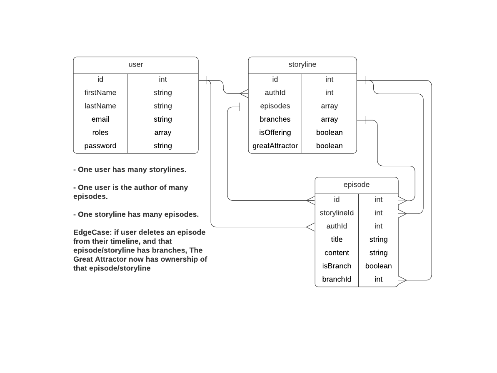

# Swirv

## Description
Swirv is a distributive story-telling platform, where every reader can branch from an author's storyline to spin their own tale.

## Demand
Traditionally, an author's greatest responsibility has been to give their readers the full story, to leave no rock unturned. This responsibility, however, curtails the author's ability to give some of their greatest ideas life. Too many brilliant, unfinished stories have never reached readers because an author must commit themselves to the stories they can end. This diservice, to both authors and readers, is out of line with the natural ways in which stories form and develop — dynamically and collaboritively. By allowing every reader the opportunity to contribute to a story, or branch from a storyline at any point to forge a new journey, Swirv realigns the ancient art of storytelling with nature. 

## User Stories

**MVP**
- As a user, I want to create a profile
- As a user, I want to create a new storyline
- As a user, I want to create a new episode in a storyline
- As a user, I want to edit my episodes and storyline
- As a user, I want to branch from another user's episodes and storylines
- As a user, I want to offer episodes and storylines to *The Great Attractor*

**Added Features**
- As a user, I want to create collections of stories to my profile
- As a user, I want to add authors, episodes, and storylines to my favorites
- As a user, I want to add episodes and storylines to "Read Later"
- As a user, I want to comment on episodes
- As a user, I want to rate episodes, storylines, and authors

## Database Architecture

